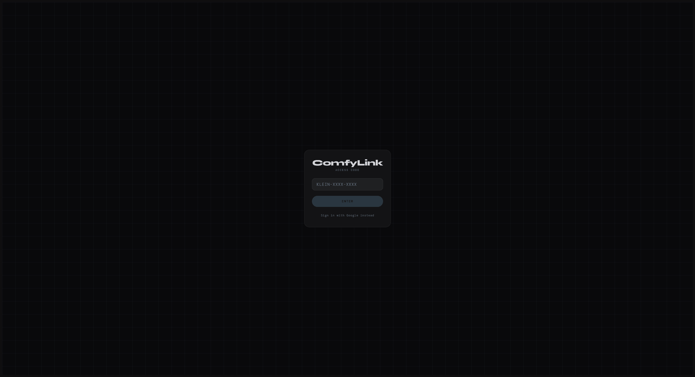
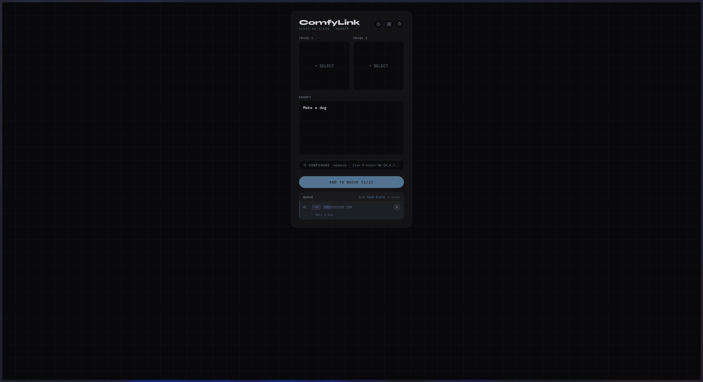
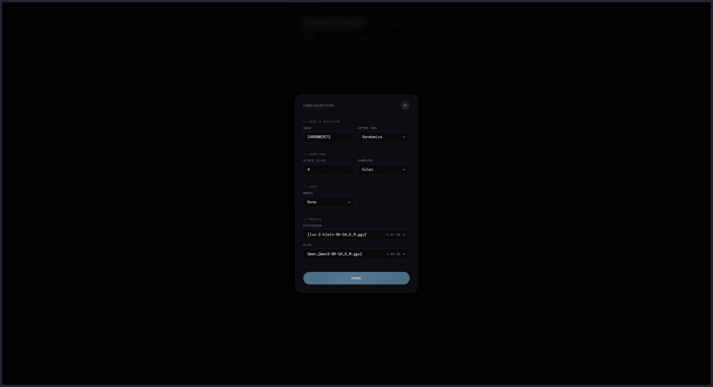
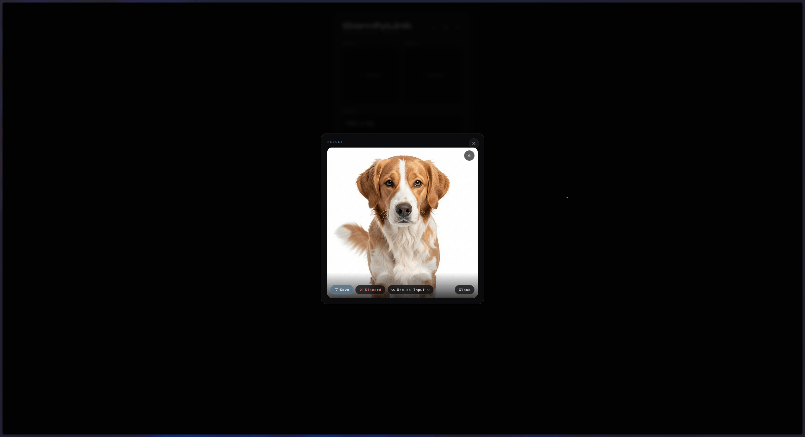
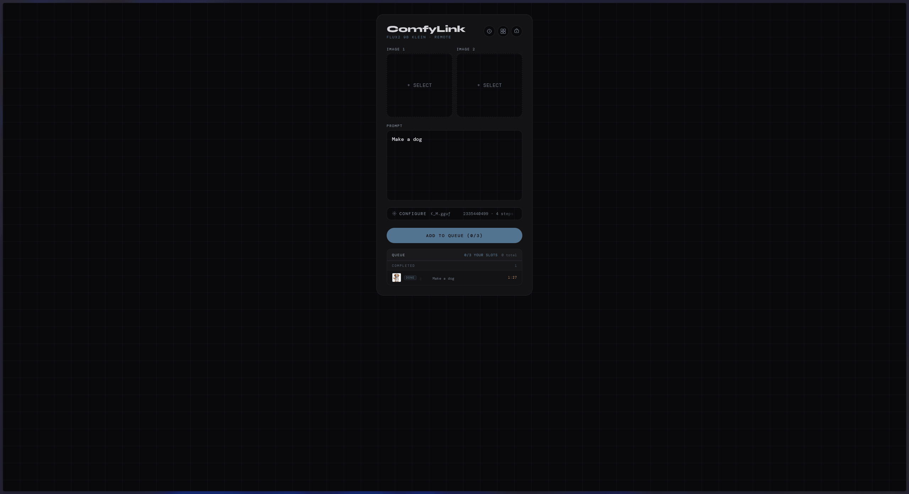

# ComfyLink

**Generate with Flux 2 from your phone. End-to-end encrypted. Your prompts stay yours.**

Run Flux 2 on your own PC's GPU and use it from any browser — phone, tablet, laptop — without exposing a single port on your home network. You deploy a lightweight relay server on a cheap VPS (or a Tailscale-connected machine); your PC connects to it outbound. The relay is architecturally blind: it forwards encrypted blobs it cannot read. No cloud subscription. No one else processing your images.

---

<table>
  <tr>
    <td align="center"><b>Login</b><br></td>
    <td align="center"><b>Login — Access Code</b><br></td>
    <td align="center"><b>Generate</b><br></td>
  </tr>
  <tr>
    <td align="center"><b>Queue — Waiting</b><br></td>
    <td align="center"><b>Queue — Current</b><br></td>
    <td align="center"><b>Configuration</b><br></td>
  </tr>
  <tr>
    <td align="center"><b>Result Preview</b><br></td>
    <td align="center"><b>Result — Expiring</b><br></td>
    <td align="center"><b>Gallery</b><br></td>
  </tr>
  <tr>
    <td align="center"><b>Unlock Vault</b><br></td>
    <td align="center"><b>Vault Settings</b><br></td>
    <td align="center"><b>Admin — Codes</b><br></td>
  </tr>
  <tr>
    <td align="center"><b>Admin — Users</b><br></td>
    <td></td>
    <td></td>
  </tr>
</table>

---

## How it works

```
[Any browser] ──── WSS encrypted ────▶ [VPS relay] ──── WSS encrypted ────▶ [PC + ComfyUI]
```

Your PC runs ComfyUI and a lightweight Python bridge. It connects *outbound* to the relay — no port-forwarding, no dynamic DNS, no firewall rules. The relay brokers WebSocket connections between your browser and your PC; it never decrypts anything.

**One PC per deployment.** ComfyLink is designed for personal or small-group use. You run the relay, you control who gets in. The relay and your PC authenticate through a shared secret (`PC_SECRET`); this is a 1:1 relationship by design.

**No public VPS required.** If you run [Tailscale](https://tailscale.com/) on both your PC and VPS, you can skip exposing the relay to the public internet entirely and keep everything inside your private mesh network.

---

## Features

- **End-to-end encryption** — every job (prompt, reference images, result) is encrypted on-device with ECDH-AES-GCM; the relay sees only opaque blobs
- **Encrypted vault** — generated images are stored as encrypted blobs; the decryption key is held by you and wrapped with your biometric/passkey or password; the server has no access to your content
- **Two distinct access paths:**
  - **Google account** — full account with quota tracking, vault, gallery, and ToS acceptance flow; suited for trusted users who will use the tool regularly
  - **Access code** — no account, no sign-up, no Google required; paste a code and generate; suited for sharing with less technical friends or one-off access
- **Per-user quotas** — admin-configurable job limits per account
- **Admin panel** — manage users, issue and revoke access codes, adjust quotas
- **WebAuthn / biometric vault unlock** — vault unlocked with passkey, fingerprint, or password; no master password typed in plaintext
- **Single-reference and multi-reference image generation** — Flux 2 Klein 9B GGUF workflow with model and quantization selection

---

## Privacy

- **Relay:** receives only encrypted blobs; cannot read prompts, reference images, or results even under compulsion
- **Vault:** encrypted blobs stored server-side; your key never leaves your device; a lawful data request produces ciphertext the server cannot decrypt
- **ComfyUI:** ComfyLink configures it with hardening flags (`--disable-metadata`, `--database-url sqlite:///:memory:`, `--verbose CRITICAL`) to reduce data retention; ComfyUI is a third-party component running on the deployer's machine — we don't control its internals
- **pc-client:** deletes each prompt from ComfyUI's in-memory history immediately after the result image is downloaded

Full detail, the deployer legal position on compelled decryption, and a plaintext metadata audit → [docs/PRIVACY.md](docs/PRIVACY.md)

---

## Get started

Ready to install? → **[SETUP.md](SETUP.md)**

| Doc | Contents |
|-----|----------|
| [docs/ARCHITECTURE.md](docs/ARCHITECTURE.md) | Workflow pipeline, job queue mechanics, encryption schemes, wire formats |
| [docs/AUTHENTICATION.md](docs/AUTHENTICATION.md) | Account lifecycle, per-user quotas, invite codes, guest mode, Terms of Service |
| [docs/VAULT.md](docs/VAULT.md) | Master key wrapping (bio/password/recovery), vault operations, result storage |
| [docs/DEPLOYMENT.md](docs/DEPLOYMENT.md) | VPS setup, GitHub Actions auto-deploy, manual deploy, Tailscale |
| [docs/API.md](docs/API.md) | Full REST API and WebSocket protocol message reference |
| [docs/CONFIGURATION.md](docs/CONFIGURATION.md) | All environment variables with defaults and descriptions |
| [docs/ADMIN.md](docs/ADMIN.md) | Admin panel tabs (Codes, Users), first-admin CLI |
| [docs/PRIVACY.md](docs/PRIVACY.md) | Privacy chain, vault data model, deployer legal position |
| [docs/TOS.md](docs/TOS.md) | Terms of Service and legal framework |
| [ComfyUI-Workflow/README.md](ComfyUI-Workflow/README.md) | Required models, custom nodes, full node map |

---

## Repo Structure

```
Flux2-9B-Klein-Remote/
├── .env.example          ← copy to .env and fill in values
├── .github/workflows/    ← GitHub Actions: auto-deploy on push to main
├── ComfyUI-Workflow/     ← visual workflow + model/node docs
├── Caddyfile             ← reverse proxy / TLS config
├── docker-compose.yml    ← VPS orchestration (server + Caddy)
├── docs/                 ← extended documentation
├── client/               ← Svelte frontend (browser-facing)
├── server/               ← Node.js/Express relay + WebSocket broker
└── pc-client/            ← Python bridge: connects relay → ComfyUI
```

---

## Terms of Service

All users — Google-authenticated or access code — are subject to the Terms of Service. Full text and legal framework (Czech Civil Code, GDPR, AI Act) → [docs/TOS.md](docs/TOS.md)

---

## License

MIT — see [LICENSE](LICENSE).
