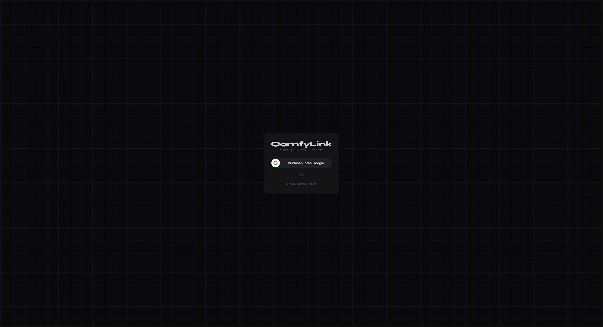
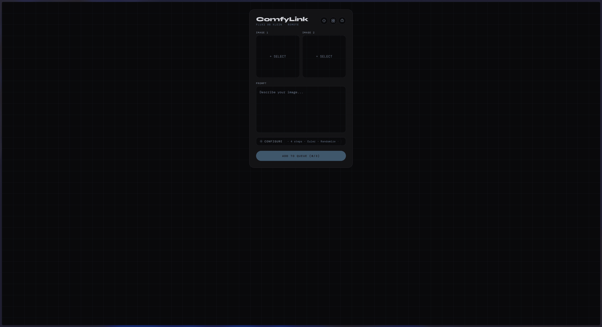
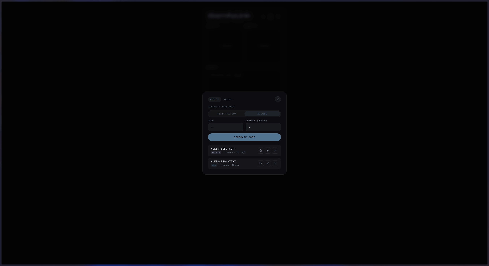
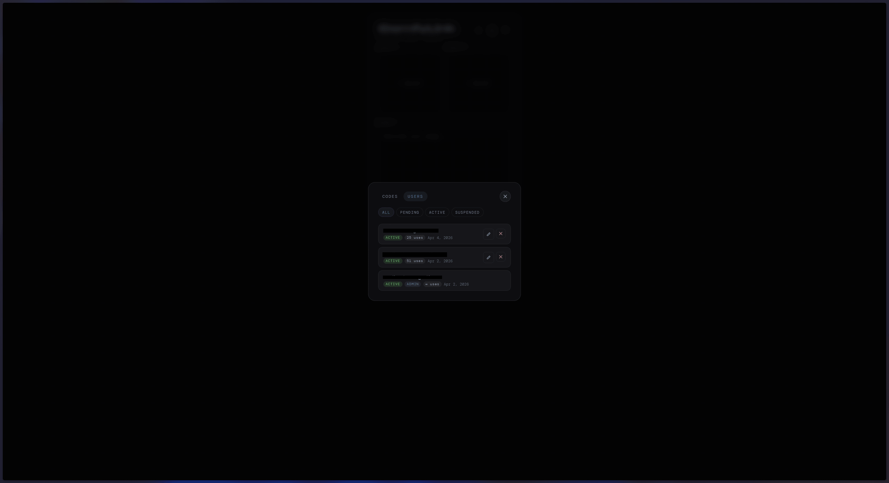
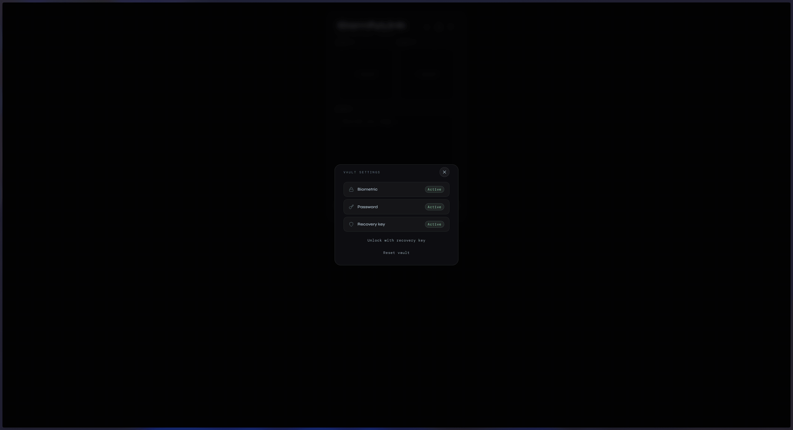
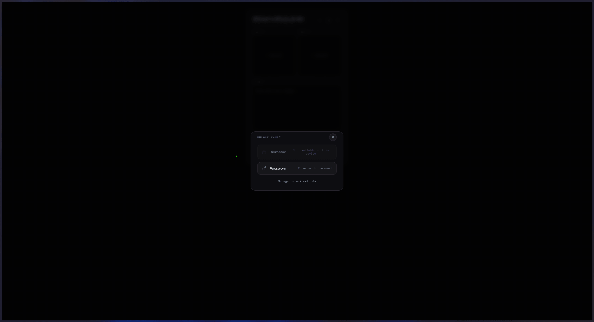

# Flux2-9B-Klein-Remote

E2E-encrypted remote ComfyUI relay for **Flux 2 Klein 9B GGUF** — the first Flux 2 model
that runs well on consumer GPUs. Send jobs from your phone → VPS relay → your PC running
ComfyUI. The relay server only ever sees opaque encrypted blobs; no prompts, images, or
results are visible to it.

```
[Phone browser] ──── WSS encrypted ────▶ [VPS relay] ──── WSS encrypted ────▶ [PC + ComfyUI]
```

---

## Screenshots

| Login | Generate |
|:-----:|:--------:|
|  |  |

| Admin — Codes | Admin — Users |
|:-------------:|:-------------:|
|  |  |

| Vault Settings | Unlock Vault | Gallery |
|:--------------:|:------------:|:-------:|
|  |  |  |

---

**Why this exists:** I wanted to run Flux 2 on my home PC's GPU and use it from my phone
without exposing any ports on my home network. The PC connects *outbound* to a cheap VPS
relay, so no port-forwarding or dynamic DNS is needed — just an internet connection on both
ends. Everything between phone and PC is end-to-end encrypted; the relay is intentionally
blind.

---

## Prerequisites

| Component | Requirement |
|-----------|-------------|
| **PC** | NVIDIA GPU with ≥ 12 GB VRAM, [ComfyUI](https://github.com/comfyanonymous/ComfyUI) installed |
| **VPS** | Any Linux VPS with Docker + Docker Compose (or a Tailscale-connected machine) |
| **Phone** | Any modern browser with WebAuthn/PRF support (Chrome 118+, Safari 17.4+) |
| **Google Cloud project** | OAuth 2.0 Client ID for user authentication (free tier is fine) |

---

## Quick Start

### 1. Clone the repo

```bash
git clone https://github.com/YOUR_USERNAME/Flux2-9B-Klein-Remote.git
cd Flux2-9B-Klein-Remote
```

### 2. Copy and edit the config

```bash
cp .env.example .env
```

At minimum set these four values:

```env
PC_SECRET=<long-random-string>          # PC WebSocket auth secret
JWT_SECRET=<another-long-random-string> # Session token signing key
GOOGLE_CLIENT_ID=<your-oauth-client-id>
VITE_GOOGLE_CLIENT_ID=<same-value>      # Vite must expose it with VITE_ prefix
```

> **Generate random secrets:** `node -e "console.log(require('crypto').randomBytes(32).toString('hex'))"`

### 3. Set up Google OAuth

1. Go to [Google Cloud Console](https://console.cloud.google.com) → APIs & Services → Credentials
2. Create an **OAuth 2.0 Client ID** (Web application)
3. Authorised JavaScript origins: `https://YOUR_DOMAIN` (or `http://localhost:5173` for dev)
4. Copy the Client ID into `GOOGLE_CLIENT_ID` and `VITE_GOOGLE_CLIENT_ID` in `.env`

### 4. Generate the PC keypair (first time only)

```bash
cd pc-client
pip install -r requirements.txt
python keygen.py
```

This creates `private_key.pem` and `public_key.pem` inside `pc-client/`.
**Back up `private_key.pem`** — losing it means vault results encrypted to this key can no longer be decrypted.

### 5. Install ComfyUI models and custom nodes

The pc-client submits workflows directly to ComfyUI's API. You need the required models and
custom node packs installed first.

See [ComfyUI-Workflow/README.md](ComfyUI-Workflow/README.md) for:

- Required model files and where to download them
- Required custom node packs (installable via ComfyUI Manager)

> **Optional:** Load `ComfyUI-Workflow/Flux2_Klein_9B_GGUF_ONLINE.json` into
> ComfyUI's visual editor (drag and drop onto the canvas) to inspect or tweak
> the node graph. This is for reference only — the pc-client uses the separate
> API-format template at `pc-client/workflow_template.json`.

> **Port note:** The pc-client connects to ComfyUI at the URL set by `COMFYUI_URL` in your
> `.env` (default `http://127.0.0.1:8188`). Make sure this matches **Settings → Server-Config → Port** in ComfyUI.

### 6. Start everything

```bash
# Terminal 1 — relay server
cd server && npm install && npm run dev

# Terminal 2 — Svelte client  (Vite proxies /auth, /ws/*, /codes, /vault, /results, /admin to localhost:PORT)
cd client && npm install && npm run dev

# Terminal 3 — PC Python bridge
cd pc-client && python main.py
```

Open the URL Vite prints (e.g. `http://localhost:5173`) in your browser and sign in with Google.

> **Testing without a GPU:** The pc-client includes `comfyui_mock.py` — a mock processor
> that returns a tinted version of your input image (no GPU required). To use it, change
> the import in `main.py` from `from comfyui import …` to `from comfyui_mock import …`.

> **Diagnosing `.env` issues:** Run `python pc-client/check_env.py` to verify that
> `PC_SECRET` is being loaded from your `.env` file correctly.

### 7. Promote the first admin

After signing in with Google for the first time, promote your account to admin:

```bash
cd server
node src/seed-admin.js your@email.com
```

This sets your account to `active` and grants admin privileges. From the Admin panel you can
then generate invite codes for other users.

---

## How It Works

### Workflow architecture

The ComfyUI workflow exists in two formats:

| File | Format | Purpose |
|------|--------|---------|
| `ComfyUI-Workflow/Flux2_Klein_9B_GGUF_ONLINE.json` | ComfyUI graph format | Visual reference for the ComfyUI editor (nodes, links, positions, UI metadata) |
| `pc-client/workflow_template.json` | ComfyUI API format | Template submitted to ComfyUI's `/prompt` endpoint at runtime |

At runtime, the pc-client:
1. Loads `workflow_template.json` once at startup
2. Deep-copies it per job, injecting the job parameters (prompt, seed, steps, sampler, lora, lora strength, GGUF quant, CLIP model)
3. Uploads images to ComfyUI via `POST /upload/image` and patches their filenames into the `LoadImage` nodes
4. Prunes unused nodes based on image count (0, 1, or 2 images) and whether a LoRA is active
5. POSTs the assembled workflow to ComfyUI's `/prompt` API
6. Monitors progress via ComfyUI's WebSocket, then downloads the output image from `/history`

See [ComfyUI-Workflow/README.md](ComfyUI-Workflow/README.md) for the full node map and
customisation instructions.

---

## Authentication & Access

Users authenticate with **Google OAuth** (ID token flow — no server-side redirect needed).

### Account lifecycle

| State | Meaning |
|-------|---------|
| `pending` | Signed in with Google but not yet approved — cannot submit jobs |
| `active` | Approved; full access to job submission and vault |
| `suspended` | Access revoked by an admin |

New accounts start as `pending` **unless** the user supplies a `registration` invite code at sign-in,
in which case they are immediately set to `active`.
### Per-user AI use quota

Each Google account has a **uses remaining** quota:

| Value | Meaning |
|-------|---------|
| `0` | No access — job submission is blocked until an admin grants uses |
| *N* (positive integer) | User may submit *N* more jobs; decrements by 1 on each successful submission |
| `null` / Unlimited | No limit — user may submit jobs freely |

New accounts always start with **0 uses**. An admin must grant uses before the user can submit their first job.
Existing accounts (created before this feature) are migrated to **Unlimited** automatically.
### Admin invite codes

Admins can generate two types of invite code from the **Admin panel** (or via the REST API):

| Type | Effect |
|------|--------|
| `registration` | Activates a new Google account immediately on sign-in |
| `job_access` | Grants a non-Google session scoped to job submission only (no vault, no admin) |

Codes have the format `KLEIN-XXXX-XXXX` and can be configured with a use limit and expiry time.

### Access code login (guest mode)

Users can enter a `job_access` code instead of signing in with Google. The server issues a
short-lived JWT with `type: "code_user"` that allows job submission. The phone WebSocket
sends `code_status` messages whenever remaining uses change.

---

## Vault & Encrypted Results

The result of each generation can be saved into an **encrypted vault** stored server-side.
The server only ever stores ciphertext — it has no access to the master key.

### Master key wrapping

A random 256-bit master key is generated in the browser and wrapped (AES-KW) up to three ways:

| Wrapping method | Key derivation | Details |
|-----------------|---------------|---------|
| **Biometric / WebAuthn PRF** | HKDF-SHA-256 from PRF output | Requires a registered WebAuthn credential with PRF extension (passkey) |
| **Password** | PBKDF2-SHA-256, 600 000 iterations | User-chosen password; salt stored server-side |
| **Recovery key** | Raw 256-bit key encoded as 24 BIP-39 words | Generated at vault setup; must be stored offline by the user |

At least the recovery method is always configured. Bio and password are optional.

### Vault operations

| Operation | Endpoint | Description |
|-----------|----------|-------------|
| Setup | `POST /vault/setup` | Store all wrapped key blobs and WebAuthn credential metadata |
| Unlock | `POST /vault/unlock` | Retrieve the wrapped master key for the chosen method |
| Rekey | `POST /vault/rekey` | Replace wrapped key blobs (e.g. change password or register new passkey) |
| Delete | `DELETE /vault` | Permanently delete vault and all stored results |

### Result storage

Results are AES-256-GCM encrypted client-side before upload. The server stores:
- A 200 px WebP thumbnail (encrypted)
- The full image (encrypted, max 20 MB per result)

IVs are stored separately; the server never sees the master key or plaintext.

---

## Admin Panel

Accessible from the UI when logged in with an admin account. Two tabs:

**CODES** — create, view, edit, and revoke invite codes.

- Generate `registration` or `job_access` codes
- Set use limits (e.g. single-use) and expiration times
- Patch remaining uses or expiry on existing codes
- Changes push immediately to connected admin and code-user sockets

**USERS** — view all user accounts, change their status, and manage their job quota.

- Filter by status (`pending`, `active`, `suspended`)
- Activate pending users or suspend active ones
- Set a user's **uses remaining**: choose *Unlimited* or enter any number 0–999,999
- Uses count is shown per row (highlighted amber when zero)
- Changes to uses are pushed to the user's live socket in real-time
- Cannot modify your own account or other admins

---

## VPS Relay Setup

The relay server routes encrypted jobs between your phone and PC. The VPS never sees
plaintext.

### One-time VPS setup

SSH into your VPS and run:

```bash
# Install Docker and Docker Compose
apt update && apt install -y docker.io docker-compose-v2

# Create the deployment directory
mkdir -p /root/flux2-9b-klein-remote

# Create the VPS .env
cat > /root/flux2-9b-klein-remote/.env << 'EOF'
PC_SECRET=your-strong-random-secret-here
JWT_SECRET=another-strong-random-secret-here
GOOGLE_CLIENT_ID=your-google-oauth-client-id
VITE_GOOGLE_CLIENT_ID=your-google-oauth-client-id
FLUX_KLEIN_HOST=your-hostname.example.com
ALLOWED_ORIGINS=https://your-hostname.example.com
EOF
```

### Automated deploy via GitHub Actions (recommended)

Push to `main` → GitHub Actions builds the Svelte frontend, uploads everything to your
VPS, and restarts Docker.

**Add these 4 secrets to your repo** (Settings → Secrets and variables → Actions):

| Secret | Value |
|--------|-------|
| `VPS_HOST` | SSH-reachable address of your VPS (IP or hostname) |
| `VPS_USER` | SSH username (e.g. `root`) |
| `SSH_PRIVATE_KEY` | Private SSH key authorised to log in to the VPS |
| `VPS_PATH` | Deployment directory on the VPS (e.g. `/root/flux2-9b-klein-remote`) |

Then push:

```bash
git push origin main
```

GitHub Actions will build the Svelte frontend, SCP all files to the VPS, and restart Docker.
Watch progress in your repo's **Actions** tab.

### Manual deploy (no GitHub Actions)

```powershell
# From project root
cd client; npm run build; cd ..
scp -r ./client/dist/* user@your-vps:/root/flux2-9b-klein-remote/client/dist/
scp ./server/package.json user@your-vps:/root/flux2-9b-klein-remote/server/
scp -r ./server/src user@your-vps:/root/flux2-9b-klein-remote/server/
scp ./docker-compose.yml ./Caddyfile user@your-vps:/root/flux2-9b-klein-remote/
ssh user@your-vps "cd /root/flux2-9b-klein-remote && docker compose up -d --build --force-recreate"
```

### Tailscale (optional — private networking)

1. Install Tailscale on VPS: `curl -fsSL https://tailscale.com/install.sh | sh && tailscale up --ssh`
2. Enable **MagicDNS** + **HTTPS Certificates** in the [Tailscale admin console](https://login.tailscale.com/admin/dns)
3. Set `FLUX_KLEIN_HOST=your-machine.tailXXXXX.ts.net` in your VPS `.env`
4. Uncomment `tls internal` in `Caddyfile`
5. Set `SKIP_TLS_VERIFY=true` in your local `.env` (so pc-client accepts the Tailscale cert)

---

## Environment Variables

All configuration lives in the single root `.env`. Copy `.env.example` to `.env` to get started.

| Variable | Default | Description |
|----------|---------|-------------|
| `PC_SECRET` | *(required)* | Shared secret authenticating the PC to the relay. Use a long random string. |
| `JWT_SECRET` | *(required)* | Secret for signing session JWTs. Generate with `node -e "console.log(require('crypto').randomBytes(32).toString('hex'))"` |
| `GOOGLE_CLIENT_ID` | *(required)* | Google OAuth 2.0 Client ID for user login |
| `VITE_GOOGLE_CLIENT_ID` | *(required)* | Same value as `GOOGLE_CLIENT_ID`; Vite requires the `VITE_` prefix to expose it to the browser |
| `DEPLOY_MODE` | `local` | `local` (connect to localhost) or `remote` (connect to `FLUX_KLEIN_HOST`) |
| `FLUX_KLEIN_HOST` | — | Hostname of the VPS serving the app (e.g. `flux2-klein.example.com`) |
| `VPS_URL` | — | Direct WebSocket URL for the relay (e.g. `wss://yourdomain.com`); overrides `DEPLOY_MODE` + `FLUX_KLEIN_HOST` when set |
| `PORT` | `3000` | Port the Node.js relay listens on |
| `SESSION_TTL_MS` | `86400000` | Phone session lifetime in ms (default: 24 h) |
| `COMFYUI_URL` | `http://127.0.0.1:8188` | URL of the local ComfyUI instance — port must match **Settings → Server-Config → Port** in ComfyUI |
| `GGUF_MODEL` | `flux-2-klein-9b-Q4_K_M.gguf` | Default diffusion model used when none is sent by the client |
| `DB_PATH` | `./data/comfylink.db` | Path to the SQLite database file (server) |
| `SKIP_TLS_VERIFY` | `false` | Skip TLS verification (use only for Tailscale / self-signed certs) |
| `PRIVATE_KEY_PATH` | `private_key.pem` | Path to the PC's private key (relative to `pc-client/`) |
| `PUBLIC_KEY_PATH` | `public_key.pem` | Path to the PC's public key |
| `RECONNECT_DELAY` | `5` | Seconds between reconnect attempts (pc-client) |
| `CLIENT_DIST_PATH` | *(auto)* | Override path to the built Svelte frontend served by the Node.js server |
| `ALLOWED_ORIGINS` | *(unset)* | Comma-separated list of allowed CORS origins (e.g. `https://yourdomain.com`). **Required in production** — if unset, all origins are allowed (dev only) |
| `VPS_USER` | `root` | SSH username for manual deployments |
| `VPS_SSH_HOST` | — | SSH address of the VPS for manual deployments |
| `VPS_PATH` | `/root/flux2-9b-klein-remote` | Deployment path for manual deployments |

---

## Terms of Service

Google-authenticated users must accept the Terms of Service before they can submit
generation jobs. The ToS is presented as a modal on first login and re-shown if the
user attempts to generate without having accepted.

Acceptance is recorded server-side (`tos_accepted_at` timestamp in the `users` table).
The terms reference Czech Republic applicable law:

- **Contract formation:** § 1724 et seq. of Act No. 89/2012 Coll. (Czech Civil Code)
- **Data protection:** Regulation (EU) 2016/679 (GDPR) as supplemented by Act No. 110/2019 Coll.
- **Prohibited content:** Act No. 40/2009 Coll. (Czech Criminal Code), Regulation (EU) 2024/1689 (AI Act)
- **Governing law:** Czech Republic; disputes resolved by Czech courts

---

## Security / Crypto

The relay is a **blind relay** — it cannot read job payloads or results.

### Job encryption (phone → PC)

| Layer | Algorithm |
|-------|-----------|
| Key exchange | ECDH P-256 (chosen over X25519 for consistent mobile browser support) |
| Key derivation | HKDF-SHA-256 (`info = "flux2-klein-v1"`) |
| Symmetric encryption | AES-256-GCM |

**Per-job forward secrecy:** The phone generates a fresh ephemeral keypair for every job.
Even if a past session key were compromised, old jobs remain protected.

**Wire format (job payload):** `[2-byte key length][ephemeral SPKI pubkey][12-byte IV][ciphertext]`

**Wire format (result payload):** `[12-byte IV][ciphertext]`

### Vault encryption (client-side)

| Layer | Algorithm | Details |
|-------|-----------|---------|
| Master key | Random 256-bit | Generated in browser, never sent in plaintext |
| Biometric wrapping | WebAuthn PRF + HKDF-SHA-256 → AES-KW | PRF salt stored server-side |
| Password wrapping | PBKDF2-SHA-256 (600 000 iter) → AES-KW | PBKDF2 salt stored server-side |
| Recovery wrapping | Raw AES-KW | Key encoded as 24 BIP-39 words (256 bits + 8-bit checksum) |
| Result encryption | AES-256-GCM | IV stored alongside ciphertext; master key used directly |

### PC secret verification

The server compares `PC_SECRET` to the received `secret` field using a **constant-time
comparison** (`timingSafeEqual`) to prevent timing attacks.

---

## WebSocket Protocol

All messages are JSON. The `payload` field is a base64 binary blob the server never decrypts.

### PC ↔ Server (`/ws/pc`)

| Direction | Message |
|-----------|---------|
| PC → Server | `{ type: "auth", secret: "..." }` — first message after connecting |
| Server → PC | `{ type: "auth_ok" }` |
| PC → Server | `{ type: "pubkey", publicKey: "<b64 SPKI>" }` — once after auth |
| Server → PC | `{ type: "job", jobId: "...", payload: "<b64>" }` |
| PC → Server | `{ type: "progress", jobId: "...", value: N, max: M, node: "..." }` |
| PC → Server | `{ type: "result", jobId: "...", payload: "<b64>" }` |
| PC → Server | `{ type: "error", jobId: "...", message: "..." }` |
| Server → PC | `{ type: "cancel", jobId: "..." }` |

### Phone ↔ Server (`/ws/phone?token=<jwt>`)

| Direction | Message |
|-----------|---------|
| Phone → Server | `{ type: "submit", payload: "<b64>" }` |
| Server → Phone | `{ type: "queued", jobId: "..." }` |
| Server → Phone | `{ type: "no_pc" }` — PC not connected |
| Server → Phone | `{ type: "progress", jobId: "...", value: N, max: M, node: "..." }` |
| Server → Phone | `{ type: "result", jobId: "...", payload: "<b64>" }` |
| Server → Phone | `{ type: "error", jobId: "...", message: "..." }` |
| Phone → Server | `{ type: "cancel", jobId: "..." }` |
| Server → Phone | `{ type: "code_status", usesRemaining: N }` — code_user sessions only |
| Server → Phone | `{ type: "uses_updated", usesRemaining: N\|null }` — Google user quota changed |
| Phone → Server | `{ type: "ping" }` — application-level keepalive (sent every 20 s by the client) |
| Server → Phone | `{ type: "pong" }` — keepalive reply |

### Admin ↔ Server (`/ws/admin?token=<jwt>`)

| Direction | Message |
|-----------|---------|
| Server → Admin | `{ type: "codes_changed" }` — invite code list changed |
| Server → Admin | `{ type: "users_changed" }` — user list changed |

---

## REST API

| Method | Path | Auth | Description |
|--------|------|------|-------------|
| `POST` | `/auth/google` | — | Exchange Google ID token (+ optional invite code) for JWT |
| `GET` | `/auth/me` | JWT | Return current user info |
| `POST` | `/auth/code` | — | Exchange a `job_access` invite code for a limited JWT |
| `GET` | `/pc-pubkey` | active/code | Get the PC's cached public key for job encryption |
| `GET` | `/health` | — | Liveness check |
| `POST` | `/codes` | admin | Create an invite code |
| `GET` | `/codes` | admin | List codes created by this admin |
| `DELETE` | `/codes/:id` | admin | Revoke an invite code |
| `PATCH` | `/codes/:id` | admin | Edit code uses remaining or expiry |
| `GET` | `/admin/users` | admin | List all users (filterable by status), includes `usesRemaining` per user |
| `PATCH` | `/admin/users/:id` | admin | Change a user's `status` (`active`/`suspended`) and/or `usesRemaining` (`null`=unlimited, 0–999999) |
| `POST` | `/vault/setup` | active | Initialise vault with wrapped key blobs |
| `GET` | `/vault/info` | active | Get vault configuration and salts |
| `POST` | `/vault/unlock` | active | Retrieve a wrapped master key blob |
| `POST` | `/vault/rekey` | active | Replace wrapped key blobs |
| `DELETE` | `/vault` | active | Delete vault and all stored results |
| `POST` | `/results` | active | Store an encrypted result (max 20 MB) |
| `GET` | `/results` | active | List results with thumbnails (paginated) |
| `GET` | `/results/:id` | active | Get full encrypted result |
| `DELETE` | `/results/:id` | active | Delete a stored result |

---

## Repo Structure

```
Flux2-9B-Klein-Remote/
├── .env.example                 ← copy to .env and fill in values
├── .github/
│   └── workflows/
│       └── deploy.yml           ← GitHub Actions: auto-deploy on push to main
├── ComfyUI-Workflow/
│   ├── Flux2_Klein_9B_GGUF_ONLINE.json   ← visual workflow (for ComfyUI editor)
│   └── README.md                ← required models, custom nodes, node map
├── Caddyfile                    ← reverse proxy / TLS config
├── docker-compose.yml           ← VPS orchestration (server + Caddy)
├── client/                      ← Svelte frontend (phone-facing)
│   └── src/
│       ├── App.svelte           ← root component, auth/routing state
│       ├── components/
│       │   ├── Login.svelte     ← Google OAuth sign-in + access code entry
│       │   ├── Submit.svelte    ← job submission, model/CLIP/LoRA selection
│       │   ├── Result.svelte    ← display + save result to vault
│       │   ├── Gallery.svelte   ← browse and decrypt saved results
│       │   ├── VaultSetup.svelte   ← initialise vault (bio/pw/recovery)
│       │   ├── VaultUnlock.svelte  ← unlock vault on session start
│       │   ├── VaultSettings.svelte ← rekey vault
│       │   └── Admin.svelte     ← invite code + user management
│       └── lib/
│           ├── api.js           ← REST helpers
│           ├── ws.js            ← WebSocket client
│           ├── crypto.js        ← ECDH job encryption / decryption
│           ├── vault-crypto.js  ← vault key derivation, AES-KW, PBKDF2
│           ├── webauthn.js      ← WebAuthn PRF registration / authentication
│           └── bip39-wordlist.js ← BIP-39 word list for recovery key encoding
├── server/                      ← Node.js/Express relay + WebSocket broker
│   └── src/
│       ├── index.js             ← Express app, REST endpoints, WebSocket handlers
│       ├── auth.js              ← Google OAuth, JWT, PC secret verification
│       ├── db.js                ← SQLite schema and prepared statements
│       ├── jobs.js              ← in-memory job queue
│       ├── relay.js             ← (reserved)
│       └── seed-admin.js        ← CLI: promote a user to admin
└── pc-client/
    ├── main.py                  ← WebSocket client — connects to relay
    ├── comfyui.py               ← builds workflow, submits to ComfyUI API
    ├── comfyui_mock.py          ← local dev mock (returns tinted image, no GPU needed)
    ├── workflow_template.json   ← API-format workflow template (submitted to ComfyUI)
    ├── crypto_utils.py          ← ECDH / AES-GCM decrypt/encrypt
    ├── keygen.py                ← generates keypair (run once)
    ├── config.py                ← reads .env, exports settings
    ├── check_env.py             ← diagnostic: verifies PC_SECRET is loaded from .env
    └── requirements.txt
```

---

## License

MIT — see [LICENSE](LICENSE).
