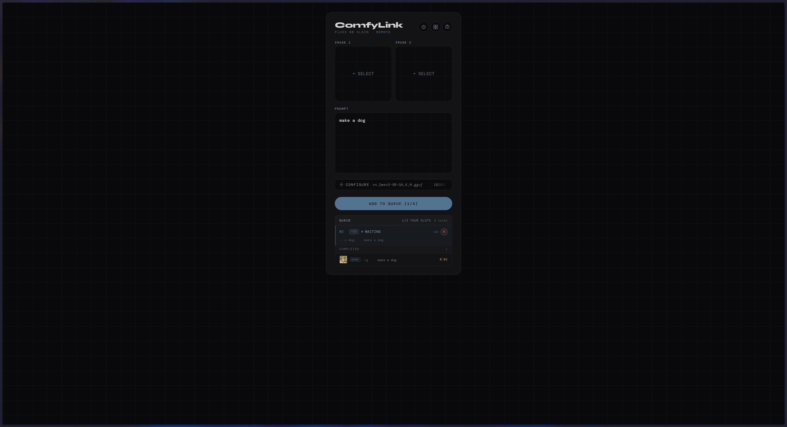

# Flux2-9B-Klein-Remote

E2E-encrypted remote ComfyUI relay for **Flux 2 Klein 9B GGUF** — the first Flux 2 model
that runs well on consumer GPUs. Send jobs from your phone → VPS relay → your PC running
ComfyUI. The relay server only ever sees opaque encrypted blobs; no prompts, images, or
results are visible to it.

```
[Phone browser] ──── WSS encrypted ────▶ [VPS relay] ──── WSS encrypted ────▶ [PC + ComfyUI]
```

**Why this exists:** I wanted to run Flux 2 on my home PC's GPU and use it from my phone
without exposing any ports on my home network. The PC connects *outbound* to a cheap VPS
relay — no port-forwarding or dynamic DNS needed. Everything between phone and PC is
end-to-end encrypted; the relay is intentionally blind.

---

<p align="center"><a href="#screenshots"><strong>📷 Screenshots</strong></a></p>

---

## Prerequisites

| Component | Requirement |
|-----------|-------------|
| **PC** | NVIDIA GPU with ≥ 12 GB VRAM, [ComfyUI](https://github.com/comfyanonymous/ComfyUI) installed |
| **VPS** | Any Linux VPS with Docker + Docker Compose (or a Tailscale-connected machine) |
| **Phone** | Any modern browser with WebAuthn/PRF support (Chrome 118+, Safari 17.4+) |
| **Google Cloud project** | OAuth 2.0 Client ID for user authentication (free tier is fine) |

---

## Quick Start

### 1. Clone the repo

```bash
git clone https://github.com/YOUR_USERNAME/Flux2-9B-Klein-Remote.git
cd Flux2-9B-Klein-Remote
```

### 2. Copy and edit the config

```bash
cp .env.example .env
```

At minimum set these four values:

```env
PC_SECRET=<long-random-string>          # PC WebSocket auth secret
JWT_SECRET=<another-long-random-string> # Session token signing key
GOOGLE_CLIENT_ID=<your-oauth-client-id>
VITE_GOOGLE_CLIENT_ID=<same-value>      # Vite must expose it with VITE_ prefix
```

> **Generate random secrets:** `node -e "console.log(require('crypto').randomBytes(32).toString('hex'))"`
>
> Full variable reference → [docs/CONFIGURATION.md](docs/CONFIGURATION.md)

### 3. Set up Google OAuth

1. Go to [Google Cloud Console](https://console.cloud.google.com) → APIs & Services → Credentials
2. Create an **OAuth 2.0 Client ID** (Web application)
3. Authorised JavaScript origins: `https://YOUR_DOMAIN` (or `http://localhost:5173` for dev)
4. Copy the Client ID into `GOOGLE_CLIENT_ID` and `VITE_GOOGLE_CLIENT_ID` in `.env`

### 4. Generate the PC keypair (first time only)

```bash
cd pc-client
pip install -r requirements.txt
python keygen.py
```

This creates `private_key.pem` and `public_key.pem` inside `pc-client/`.
**Back up `private_key.pem`** — losing it means vault results encrypted to this key can no longer be decrypted.

### 5. Install ComfyUI models and custom nodes

See [ComfyUI-Workflow/README.md](ComfyUI-Workflow/README.md) for required model files and custom node packs.

> **Port note:** The pc-client connects to ComfyUI at `COMFYUI_URL` in your `.env` (default `http://127.0.0.1:8188`). Match this to **Settings → Server-Config → Port** in ComfyUI.

### 6. Start everything

```bash
# Terminal 1 — relay server
cd server && npm install && npm run dev

# Terminal 2 — Svelte client
cd client && npm install && npm run dev

# Terminal 3 — PC Python bridge
cd pc-client && python main.py
```

Open the URL Vite prints (e.g. `http://localhost:5173`) and sign in with Google.

> **No GPU?** Use `comfyui_mock.py` — swap the import in `main.py` to get a tinted placeholder image instead.
>
> **Env issues?** Run `python pc-client/check_env.py` to verify `PC_SECRET` is loading correctly.

### 7. Promote the first admin

```bash
cd server && node src/seed-admin.js your@email.com
```

See [docs/ADMIN.md](docs/ADMIN.md) for managing users and invite codes from that point on.

---

## Documentation

| Doc | Contents |
|-----|----------|
| [docs/ARCHITECTURE.md](docs/ARCHITECTURE.md) | Workflow pipeline, job queue mechanics, encryption schemes, wire formats |
| [docs/AUTHENTICATION.md](docs/AUTHENTICATION.md) | Account lifecycle, per-user quotas, invite codes, guest mode, Terms of Service |
| [docs/VAULT.md](docs/VAULT.md) | Master key wrapping (bio/password/recovery), vault operations, result storage |
| [docs/DEPLOYMENT.md](docs/DEPLOYMENT.md) | VPS setup, GitHub Actions auto-deploy, manual deploy, Tailscale |
| [docs/API.md](docs/API.md) | Full REST API and WebSocket protocol message reference |
| [docs/CONFIGURATION.md](docs/CONFIGURATION.md) | All environment variables with defaults and descriptions |
| [docs/ADMIN.md](docs/ADMIN.md) | Admin panel tabs (Codes, Users), first-admin CLI |
| [ComfyUI-Workflow/README.md](ComfyUI-Workflow/README.md) | Required models, custom nodes, full node map |

---

## Screenshots

<table>
  <tr>
    <td align="center"><b>Login</b><br></td>
    <td align="center"><b>Login — Access Code</b><br></td>
    <td align="center"><b>Generate</b><br></td>
  </tr>
  <tr>
    <td align="center"><b>Queue — Waiting</b><br></td>
    <td align="center"><b>Queue — Current</b><br></td>
    <td align="center"><b>Configuration</b><br></td>
  </tr>
  <tr>
    <td align="center"><b>Result Preview</b><br></td>
    <td align="center"><b>Result — Expiring</b><br></td>
    <td align="center"><b>Gallery</b><br></td>
  </tr>
  <tr>
    <td align="center"><b>Unlock Vault</b><br></td>
    <td align="center"><b>Vault Settings</b><br></td>
    <td align="center"><b>Admin — Codes</b><br></td>
  </tr>
  <tr>
    <td align="center"><b>Admin — Users</b><br></td>
    <td></td>
    <td></td>
  </tr>
</table>

---

## Repo Structure

```
Flux2-9B-Klein-Remote/
├── .env.example          ← copy to .env and fill in values
├── .github/workflows/    ← GitHub Actions: auto-deploy on push to main
├── ComfyUI-Workflow/     ← visual workflow + model/node docs
├── Caddyfile             ← reverse proxy / TLS config
├── docker-compose.yml    ← VPS orchestration (server + Caddy)
├── docs/                 ← extended documentation
├── client/               ← Svelte frontend (phone-facing)
├── server/               ← Node.js/Express relay + WebSocket broker
└── pc-client/            ← Python bridge: connects relay → ComfyUI
```

---

## License

MIT — see [LICENSE](LICENSE).
